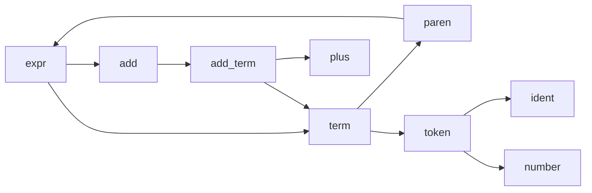

# goscal
https://github.com/msakuta/ruscal の写経 in Go言語

```mermaid
graph LR
expr --> add
expr --> term

add --> add_term
add_term --> term
add_term --> plus

term --> paren
term --> token

paren --> expr

token --> ident
token --> number
```
